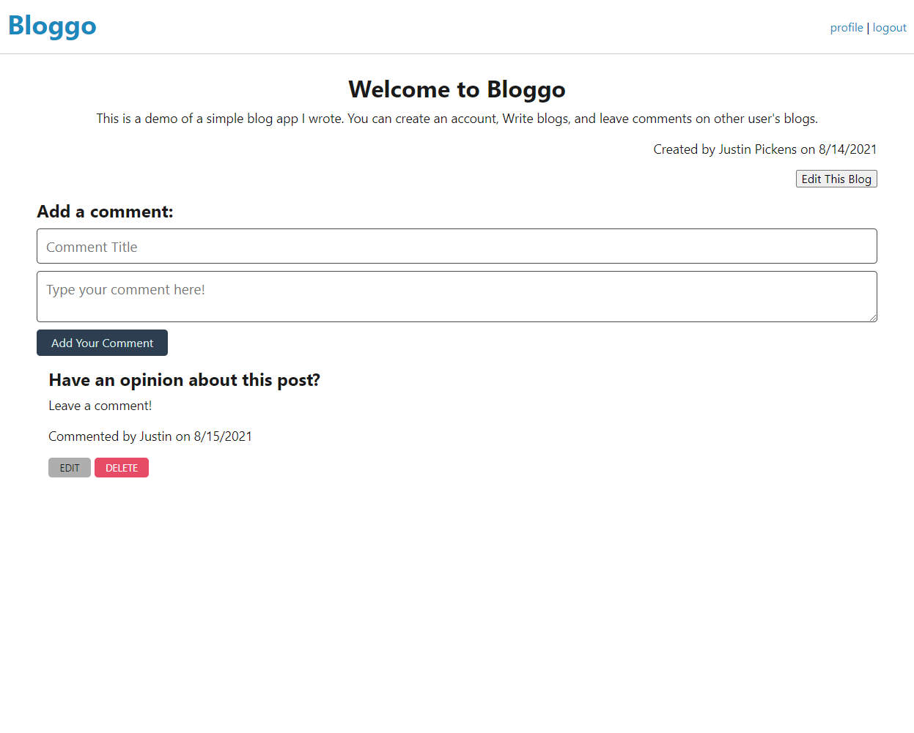

# Simple Blog

## Description
An interactive blogging site using the Model/View/Controller paradigm for serving up content. This site has POST, GET, PUT, and DELETE routes for blog posts and comments.

## Screenshot

## Deployed Example
[Bloggo!](https://simple-blog-jcpickens0215.herokuapp.com/)

## Installation
Required: Node.js and MySql Server.

After cloning the repository, run the command **npm install** or **npm i**. With the included .env.EXAMPLE file, fill in your MySQL username and password, then change the file's name to **.env**. Run the included schema file (db/schema.sql) with your preferred method. If you wish to start with seed data, edit the files: users.json, blogs.json, and comments.json. To seed the database, run the command **npm run seed**.
## Usage
To run the server locally, run the command **npm run start**, then connect to 'http://localhost:3001' in your browser.
## Questions
If you have any questions about this project, you can find me on GitHub as [jcpickens0215](https://github.com/jcpickens0215).

## License

Licensed under the [MIT License](https://mit-license.org/)
, copyright 2021 by Justin Pickens
____

Badges provided by [Shields.io](https://shields.io/)
